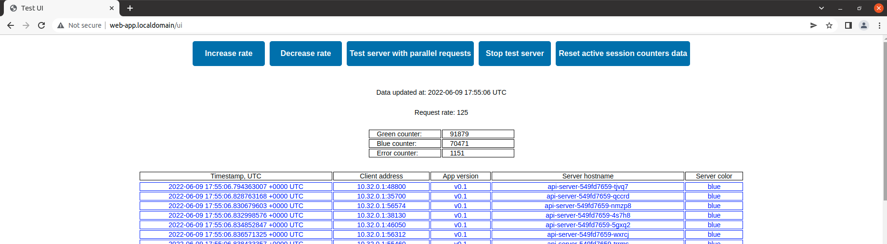
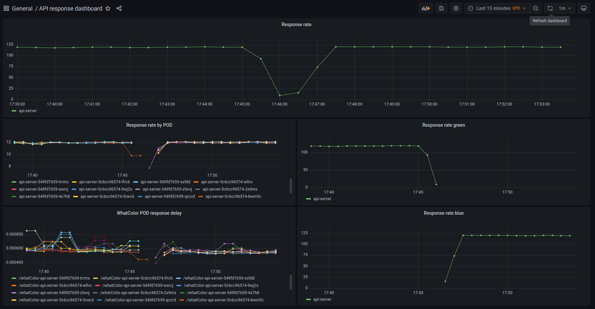

## Test project for IAC demo

#### Technology overview:
- Github (Source Code Management)
- Jenkins (Configuring SCM, Build Jobs And Polling SCM)
- Kubernetes (Container orchestration platform)
- Docker (Kubernetes container runtime)
- Kaniko (Building and publish image)
- Ansible (Configuration management system)
- Terraform (Infrastructure as code software tool)
- Helm, Kubectl (kubernetes configuration management tools)
- Libvirt, Qemu-KVM (Virtualization Technology)

#### Test application code:
- Golang application
- HTML/CSS/Javascript Web UI Kits

#### Project stages:
1. Deploy virtual machines (Terraform)
1. Configure virtual machines (Ansible)
1. Deploy and set up Kubernetes ingress controller Nginx
1. Deploy and set up Kubernetes metrics server
1. Deploy and set up Kubernetes dashboard
1. Deploy and set up Docker-registry in Kubernetes
1. Deploy and set up Jenkins in Kubernetes
1. Congifure external/internal DNS for Kubernetes Ingress (via /etc/hosts)
1. Build k8s-utilities-image container(Docker/Kaniko) 
1. Setup CI/CD Pipeline in Jenkins via Jenkinsfile and Github
1. Deploy application via Jenkins Pipeline (Jenkins/Helm/Kubectl)
1. Deploy kube-prometheus-stack via Helm and setup Grafana monitoring dashboard

#### Virtual machine configuration:
|                       |  CPU  | RAM | Disk |
| --------------------- |:-----:|:---:|:----:|
| k8s-master01          | 4vCPU | 8GB | 20GB |
| k8s-node01 (optional) | 2vCPU | 2GB | 20GB |


#### DNS for Kubernetes Ingress:
- 192.168.122.11 kubedash.localdomain
- 192.168.122.11 jenkins.localdomain
- 192.168.122.11 docker-registry.localdomain
- 192.168.122.11 web-app.localdomain
- 192.168.122.11 api-server.localdomain
- 192.168.122.11 grafana.localdomain
- 192.168.122.11 prometheus.localdomain
- 192.168.122.11 alertmanager.localdomain

#### Some useful commands described in code:
```
./run.sh help
```

#### Helm update api-server results:
```
./run.sh helm-deploy-api-server
```

